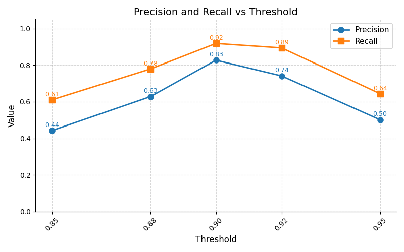

# Deduplication Evaluation Report

## Evaluation Logic Overview

This evaluation logic evaluates the performance of a deduplication process by comparing an **original dataset** with a **deduplicated dataset**.

### 1. Fingerprint Generation

- **Key Columns**: Generates a fingerprint based on selected fields (e.g., Full Name, Email, Company, Course).
- **Normalization**: Fingerprints are constructed by concatenating valid, normalized field values to ensure similar records produce identical identifiers

### 2. Determining Ground Truth

The script counts how many times each fingerprint appears in the original dataset:

- **Duplicates**: Records with the same fingerprint appearing more than once.
- **Unique**: Records appearing only once.

### 3. Comparison and Classification

The script compares fingerprints against the deduplicated dataset using the following logic:

- **True Positive (TP)**: A duplicate record is correctly retained.
- **False Negative (FN)**: A duplicate record is incorrectly removed.
- **True Negative (TN)**: A unique record is correctly retained.
- **False Positive (FP)**: A unique record is incorrectly removed.

### 4. Metrics Reporting

Finally, the script computes **Precision** and **Recall**, reporting the total classification results and the expected size of the deduplicated dataset.

## Deduplication Agent Evaluation Results (Based on Threshold Tuning)

Since the threshold increases from 0.85 to 0.95, both precision and recall first show a clear upward trend and then decline after reaching a peak. Therefore, we initially speculate that the optimal threshold is around 0.90. Based on experimental results at different thresholds, the deduplication agent exhibits a typical trade-off between Precision and Recall, with performance peaking at mid-range thresholds rather than continuously improving.

The graph shows that precision increases steadily with the threshold, from 0.44 at 0.85 to 0.83 at 0.90, and then declines to 0.50 at 0.95. This indicates that the model reduces false positives (FP) as the threshold increases up to a certain point, but becomes overly strict at higher thresholds. Recall follows a similar pattern, increasing from 0.61 at 0.85 to 0.92 at 0.90, before decreasing to 0.64 at 0.95, demonstrating that the model’s ability to identify duplicate data improves initially but deteriorates when the threshold becomes too high, increasing false negatives (FN).

Based on experimental data, the overall model performance improves significantly up to the threshold of 0.90, where both precision and recall reach their peak. Beyond this point, both metrics decline, indicating that the model begins to lose balance between identifying duplicates and avoiding incorrect matches.

### Optimal Threshold Range

In threshold sensitivity analysis, [0.88, 0.92] was determined to be the optimal value range. Specific performance balance is as follows:

- **Equilibrium Point Analysis:**

  When the threshold is set to 0.88, P ≈ 0.63 and R ≈ 0.78, achieving a reasonable balance between the two metrics.

- **High Recall Tendency:**

  As the threshold increases to 0.92, precision is around 0.74, and recall remains relatively high at around 0.89. This configuration is suitable for business scenarios with low tolerance for missed detections.

- **Peak Performance and Risk Warning:**

  When the threshold reaches 0.90, the model achieves optimal statistical performance (P ≈ 0.83, R ≈ 0.92). However, further increasing the threshold leads to a decline in both precision and recall, indicating that excessively high thresholds may cause the model to miss true duplicates due to over-strict similarity requirements.

### Conclusions and Improvement Suggestions

The current deduplication agent exhibits a clear performance peak around the mid-range threshold, indicating that the current deduplication strategy is effective but sensitive to threshold selection.

### Limitations of Test Data

Since the test data was dummy data provided by BlackBerry CCoE, the main deduplication metrics considered in general tests (full name, email, phone number, etc.) were encrypted and anonymized, and therefore cannot be used as the main features for deduplication in this project. Consequently, the results of this project differ significantly from those in actual production, requiring further modifications and improvements.